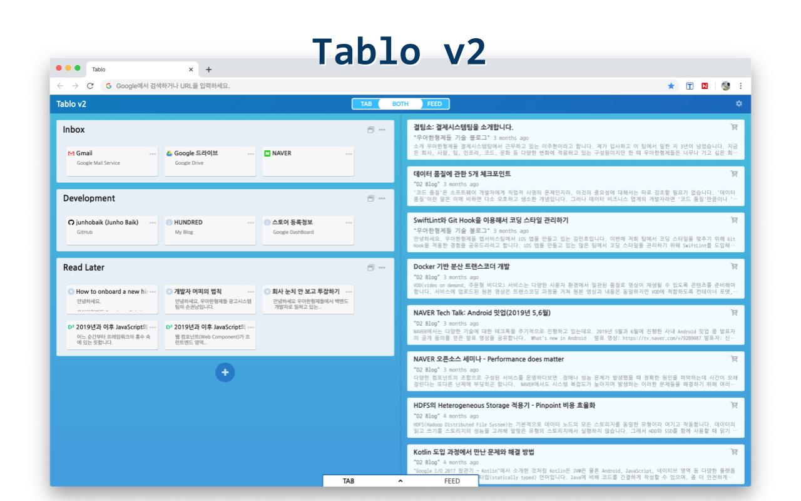

# Tablo v2 (가제)

[Chrome Web Store - Tablo v2](https://chrome.google.com/webstore/detail/tablo-v2-beta/aflhcldanmopecmjjinnenkcddghjnkn)

</img>

---

기존 [Tablo](https://github.com/junhobaik/tablo) 웹앱을 개선하고 Feed(rss) 구독 기능을 추가한 새로운 웹앱.

다양한 방법으로 웹페이지를 스크랩하고, 스크랩한 링크들을 자신만의 북마크처럼 관리할 수 있습니다.  
또한 RSS 구독 기능으로 구독한 게시물을 보고 스크랩할 수 있습니다.

## Tablo v2

1. 다양한 방법으로 웹페이지를 스크랩하고, 스크랩한 링크들을 자신만의 북마크처럼 관리할 수 있습니다.
2. 또한 RSS 구독 기능으로 구독한 게시물을 보고 스크랩할 수 있습니다.
3. 한화면에서 북마크, 구독 게시물을 편하게 보고 관리할 수 있습니다.

### 주요 기능

TAB, FEED 그리고 Menu로 화면이 나뉩니다.  
TAB과 FEED는 하나만 보거나 함께 보기가 가능하며,  
Menu는 하단에서 서랍식 UI로 꺼내고 집어넣을 수 있습니다.  
또한 확장 프로그램 아이콘을 통해 웹서핑중에서도 웹앱의 기능을 활용할 수 있습니다.

- **TAB**  
  _스크랩한 링크들을 카테고리별로 관리하는 화면입니다._
  - 링크들을 클릭해 해당 링크를 열 수 있습니다.
  - 링크들을 분류할 카테고리를 만들고 관리(수정, 제거)합니다.
  - 카테고리 안의 링크를 한꺼번에 열 수 있습니다.
  - 링크의 제목과 설명을 수정, 링크를 제거할 수 있습니다.
  - 드래그를 통해 링크의 카테고리를 변경하거나 순서를 변경할 수 있습니다.
- **FEED**  
  _구독한 RSS 사이트의 게시물들의 리스트가 있는 화면입니다._
  - 구독한 사이트들의 게시물 목록이 보입니다.
  - 전체 게시물은 일정 시간마다 새로 불러오게 됩니다.
    - 불러오는 중인 사이트들의 목록을 상단의 로딩창을 통해 확인 할 수 있습니다.
    - 만약 불러오기에 실패한다면 해당 실패한 사이트를 로딩창 아래의 오류창을 통해 확인 할 수 있습니다.
  - 리스트의 게시물을 카트(Cart)에 담을 수 있습니다.
  - ~~리스트의 게시물을 TAB창으로 드래그해 링크로 추가할 수 있습니다.~~ (미구현)
- **Menu**  
  _TAB을 관리하는 Menu, Feed를 관리하는 Menu로 나뉩니다._
  - W, S 키로 메뉴창을 올리고 내릴 수 있습니다.
  - **TAB Menu**
    - 현재 브라우저에 열려있는 모든 탭의 링크 리스트가 출력되는 현재 탭 화면이 있습니다.
    - 웹 서핑중 스크랩했거나, FEED의 게시물을 스크랩한 링크들이 있는 카트 화면이 있습니다.
    - 카트에 존재하는 링크를 삭제할 수 있습니다.
    - 링크를 TAB으로 드래그하여 원하는 카테고리 안으로 추가할 수 있습니다.
  - **FEED Menu**
    - 현재 구독한 RSS 사이트들의 리스트가 보입니다.
    - 사이트의 관리(제목 수정, 삭제)가 가능합니다.
    - 사이트는 카테고리로 분류하여 관리 할 수 있습니다.
    - RSS FEED 주소를 통해 사이트를 추가 할 수 있습니다.
      - 주소 유효성 검사 기능을 통해 해당 사이트가 구독이 가능한 사이트인지를 알려줍니다.
      - 주소 유효성 검사 중 대표적인 rss 주소 규칙을 대입하여 자동으로 주소를 완성시켜줍니다.
    - 특정한 사이트를 숨기기 토글 아이콘을 통해 FEED화면에서 해당 사이트의 게시물을 숨기거나 활성화 할 수 있습니다.
    - 특정한 사이트뿐 아니라 카테고리 별로 숨기거나 활성화 할 수도 있습니다.
- Setting  
  _웹앱 전체적인 설정을 할 수 있습니다._
  - TAB의 링크 또는 카테고리, FEED의 게시물들을 클릭할 때 현재 브라우저탭 또는 새탭에서 열기 설정이 가능합니다.
  - Menu를 항상 열림 상태를 유지할 수 있는 옵션.
  - TAB의 링크 또는 FEED의 게시물을 더 작게 표시하는 Minimize 옵션.
  - 전체 피드 게시물을 새로 불러올 기간 설정.
  - 오래된 피드 게시물을 숨길 수 있는 옵션
  - 웹앱 색상 테마 설정.
- **확장 프로그램 아이콘**  
  _웹 서핑 중 확장 프로그램 아이콘을 통해 아래 기능을 사용할 수 있습니다_
  - 현재 보고있는 사이트를 카트에 담을 수 있습니다.
  - 현재 보고있는 사이트가 RSS 구독을 지원한다면 구독 중인 FEED 리스트에 추가 할 수 있습니다.
    - 현재 보고있는 사이트가 RSS 구독이 지원 가능한지 대표적인 rss 주소들을 대입해 검사합니다.

## Tech Stack

- Framework:
  - **React**
  - **redux (react-redux)**
- Bundler: **Parcel**
- Style:
  - **SASS (SCSS)**
  - **semantic-ui-react**
- Linter & Formatter: **ESLint** & **Prettier**
- etc:
  - **chrome APIs**
  - ...
